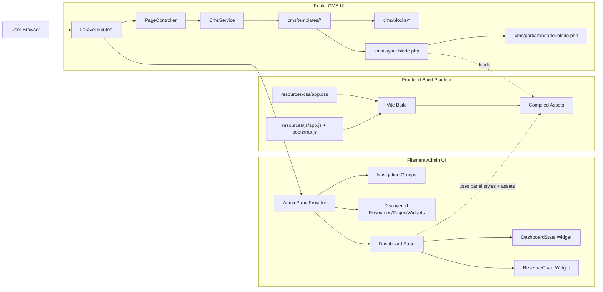

# UI Architecture

Last updated: 2026-07-24

## 1. Overview

This application has two UI surfaces built from the same frontend pipeline:

1. Public CMS UI (site pages, account pages, CMS blocks)
2. Filament Admin UI (admin panel, resources, settings pages, dashboard widgets)

Both surfaces are compiled through Vite and styled primarily via Tailwind v4 plus custom CSS variables in a shared stylesheet.

## 1.1 Architecture Diagram

## 2. Build and Runtime Pipeline

### 2.1 Vite Entry Points

Vite is configured to compile:

- `resources/css/app.css`
- `resources/js/app.js`

`app.js` imports `bootstrap.js`, which initializes:

- Axios for HTTP requests
- Alpine.js for UI state and lightweight interactivity

### 2.2 Tailwind v4 Integration

Tailwind is loaded via:

- `@tailwindcss/vite` in `vite.config.js`
- `@import 'tailwindcss'` in `resources/css/app.css`

Template discovery is handled through `@source` globs in `resources/css/app.css` so utility classes from Blade and JS are included in builds.

## 3. Styling System

## 3.1 Token Strategy

`resources/css/app.css` defines CSS custom properties for two style sets:

1. Admin defaults (applies to `:root`, `.fi-body`, and `[data-filament-panel-id]`)
2. CMS overrides (applies to `.cms-page`)

Token families include:

- Brand: `--color-primary`, `--color-secondary`, `--color-tertiary`, `--color-accent`
- Feedback: `--color-success`, `--color-warning`, `--color-danger`
- Text: `--color-primary-text`, `--color-success-text`, `--color-warning-text`, `--color-danger-text`
- Navigation: `--menu-bg`, `--menu-hover`, `--menu-active`, `--menu-text`, `--menu-border`
- CMS surface/ink: `--cms-surface`, `--cms-ink`, `--cms-muted`

Dark mode is supported for CMS through:

- Explicit `html.dark .cms-page`
- System fallback `@media (prefers-color-scheme: dark)`

## 3.2 Shared Utility Classes

Custom class groups in `app.css` include:

- Header/nav: `.cms-header`, `.cms-nav-link`, `.cms-drawer`
- Surfaces: `.cms-panel`
- Actions: `.cms-btn`, `.cms-btn--primary`, `.cms-btn--outline`, `.cms-btn--sm`
- Content tone: `.cms-muted`, `.cms-link-gold`, `.cms-divider`

Interactivity helper:

- `[x-cloak] { display: none !important; }` prevents Alpine pre-hydration flicker.

## 4. Public CMS UI Architecture

## 4.1 Layout Shell

`resources/views/cms/layout.blade.php` is the shared page shell:

1. Includes Vite assets
2. Adds `.cms-page` on `<body>` for CMS token scope
3. Includes shared partials:
   - `cms.partials.header`
   - `cms.partials.footer`
4. Renders page body with `@yield('content')`

## 4.2 Header and Navigation

`resources/views/cms/partials/header.blade.php` owns:

- Desktop and mobile nav rendering
- Auth-aware menu (login vs user dropdown)
- Avatar fallback behavior (image with inline SVG fallback)
- Alpine state for drawer and user dropdown

It is the main composition point for identity, primary navigation, and account actions.

## 4.3 CMS Content Composition

CMS content is block-driven:

- Templates: `resources/views/cms/templates/*`
- Blocks: `resources/views/cms/blocks/*`

The controller/service layer selects a template and injects ordered active blocks.

## 5. Admin UI Architecture (Filament)

## 5.1 Panel Provider as UI Root

`app/Providers/Filament/AdminPanelProvider.php` is the root of admin UI composition:

- Panel identity and route path
- Auth pages (login/register/profile/password reset/verification/MFA)
- Color configuration
- Navigation grouping and behavior
- Discovery of resources, pages, widgets
- Global widgets (`DashboardStats`, `AccountWidget`)

## 5.2 Navigation Groups and Collapse Behavior

Configured groups:

1. CMS
2. Control Panel
3. Administration

Behavior settings:

- Fully collapsible sidebar on desktop
- Collapsible navigation groups

Important Filament rule:

- If a navigation group has an icon, items inside that group must not also define their own `navigationIcon`.
- This project currently follows group-level icons for these three groups to support collapsed sidebar discoverability.

## 5.3 Dashboard Composition

Dashboard page:

- Class: `app/Filament/Pages/Dashboard.php`
- View wrapper: `resources/views/filament/pages/dashboard.blade.php`

Header widgets:

1. `App\Filament\Widgets\Stats\DashboardStats`
2. `App\Modules\Dashboard\Filament\Widgets\RevenueChart`

Widget responsibilities:

- `DashboardStats`: summary KPI cards
- `RevenueChart`: full-width line chart trend panel

## 5.4 Module-aware Admin UI Discovery

`AdminPanelProvider::discoverModules()` auto-discovers Filament UI extensions from:

- `app/Modules/<ModuleName>/Filament/Resources`
- `app/Modules/<ModuleName>/Filament/Pages`
- `app/Modules/<ModuleName>/Filament/Widgets`

This keeps module UIs pluggable without hardcoding each module in provider configuration.

## 6. Reusable Blade Component Layers

Component namespaces currently include:

- `resources/views/components/ui/*` (generic UI components)
- `resources/views/components/mas/*` (legacy style components)

Use `components/ui` for current work. Keep `components/mas` only where legacy views still depend on them, and avoid introducing new dependencies there unless intentionally maintaining legacy markup.

## 7. Conventions for Future UI Work

1. Keep `resources/css/app.css` as the single theme source of truth.
2. Prefer CSS variables + semantic classes over hardcoded colors in Blade.
3. For Filament navigation, choose one icon strategy per group:
   - Group icons only, or
   - Item icons only.
4. Validate UI config changes with:
   - `php artisan view:cache`
   - `npm run build`
5. When adding module dashboards/widgets, register on the target page and confirm they are visible in `getHeaderWidgets()`.

## 8. Quick File Map

- `vite.config.js`
- `resources/css/app.css`
- `resources/js/app.js`
- `resources/js/bootstrap.js`
- `resources/views/cms/layout.blade.php`
- `resources/views/cms/partials/header.blade.php`
- `resources/views/cms/templates/*`
- `resources/views/cms/blocks/*`
- `app/Providers/Filament/AdminPanelProvider.php`
- `app/Filament/Pages/Dashboard.php`
- `resources/views/filament/pages/dashboard.blade.php`
- `app/Filament/Widgets/Stats/DashboardStats.php`
- `app/Modules/Dashboard/Filament/Widgets/RevenueChart.php`
- `resources/views/components/ui/*`
- `resources/views/components/mas/*`
